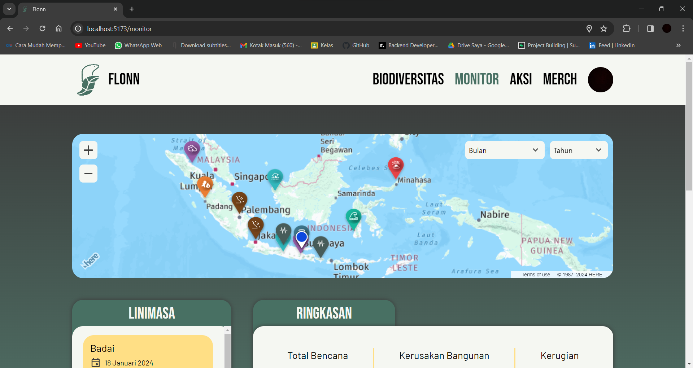
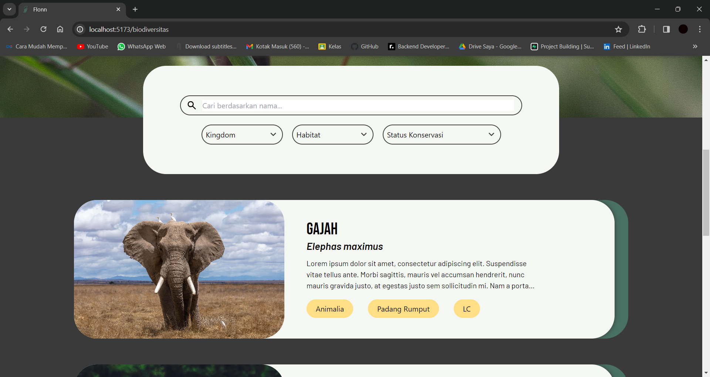
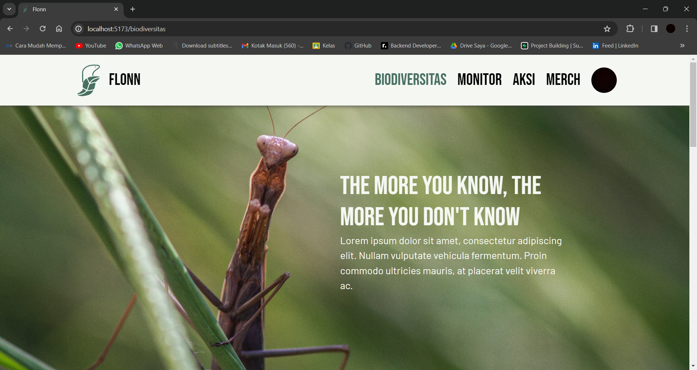

# What is Flonn?

Flonn adalah platform web yang fokus pada kampanye lingkungan sosial di mana pengguna dapat memantau dampak bencana alam, status konservasi biodiversitas, dan menyumbangkan sumber daya mereka untuk masa depan yang lebih baik.

# Our Team: Pubek
Hello, we are from Brawijaya University
- Naufal Afkaar (Hustler & PIC)
- Emilia Syah Putri (Hustler)
- Maritza Aliya Devi (Hipster)
- Muhammad Iqbal Muzakki (Hacker)

# How to run?

To run Flonn locally, you need to follow these steps:

## Prerequisites
- Node.js and npm installed on your machine.
- Go installed on your machine.
- XAMPP with MySQL installed locally.

## Front-End (React with Vite)
1. Clone the repository to your local machine:

    ```bash
    git clone https://github.com/zakkimuzakki25/flonn.git
    ```

2. Navigate to the client directory:

    ```bash
    cd flonn/client
    ```

3. Install dependencies:

    ```bash
    npm install
    ```

4. Create a `.env` file in the `client` directory and add the following:

    ```env
    VITE_HERE_MAPS_KEY="ktOIeu7N3XvEfSxgyyR6FuDCbXIuwwrVh1683u6JRvk"
    VITE_FIREBASE_API_KEY="(the key)"
    ```

5. Run the React development server:

    ```bash
    npm run dev
    ```

    This will start the Vite development server and open Flonn in your default web browser.

## Back-End (Go with MySQL)
1. Navigate to the server directory:

    ```bash
    cd flonn/server
    ```

2. Install Go packages:

    ```bash
    go get
    ```

3. Create a `.env` file in the `server` directory and add the following:

    ```env
    PORT=8080
    DB_USERNAME=root
    DB_PASSWORD=
    DB_DATABASE=flonn
    DB_HOST=localhost
    DB_PORT=3306
    SECRET_KEY=yourkey
    ```

    Adjust the MySQL credentials according to your XAMPP setup.

4. Run the Go server:

    ```bash
    go run cmd/app/Main.go
    ```

    This will start the Go server, and it should connect to the MySQL database.

Now, you should be able to access Flonn by opening your browser and navigating to `http://localhost:5173`.

Make sure your XAMPP apache and MySQL server is running before starting the Go server.

Feel free to reach out if you encounter any issues during the setup!


# Slicing result (Front-End)
## Home Page





## Biodiversity Page




## Monitor Page




# API Response (Back-End)

## Disaster


## Biodiversity

