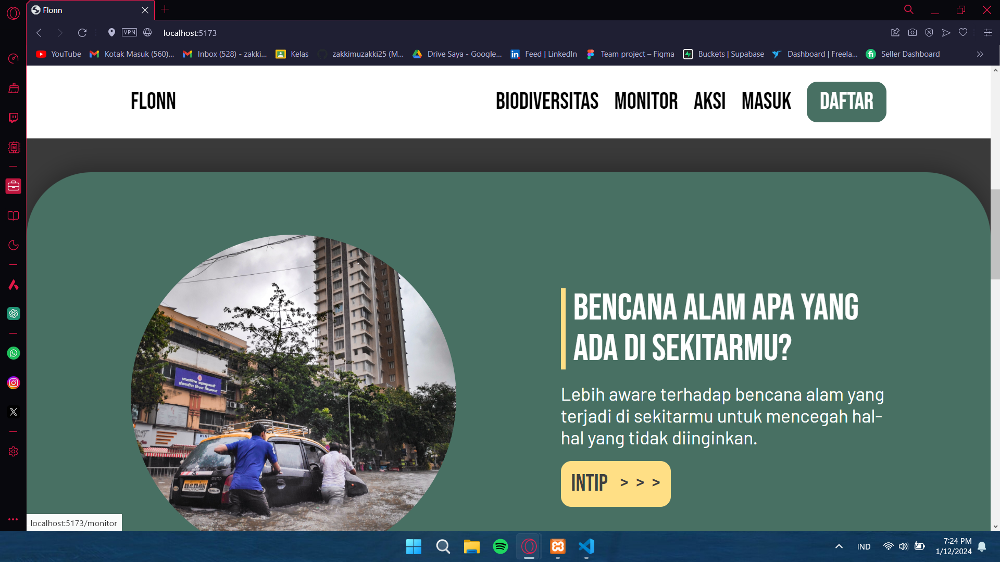
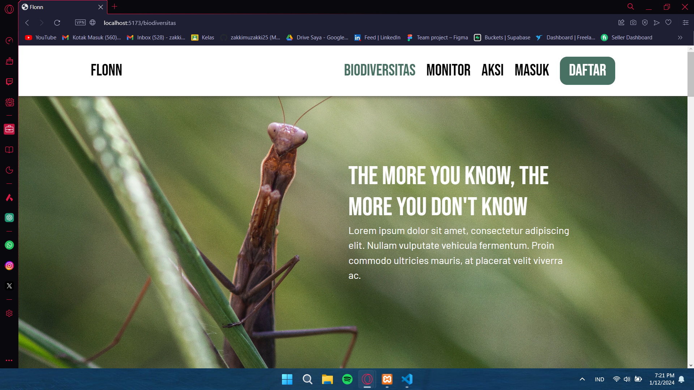
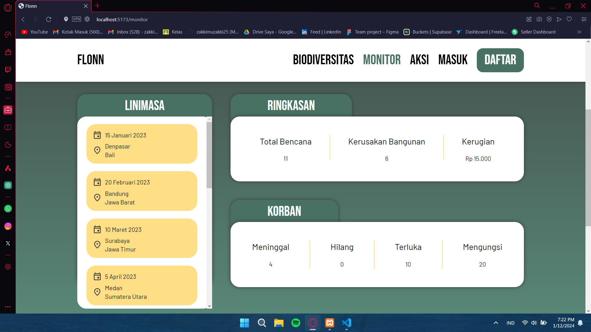

# What is Flonn?

Flonn adalah platform web yang fokus pada kampanye lingkungan sosial di mana pengguna dapat memantau dampak bencana alam, status konservasi biodiversitas, dan menyumbangkan sumber daya mereka untuk masa depan yang lebih baik.

# Our Team: Pubek
Hello, we are from Brawijaya University
- Naufal Afkaar (Hustler & PIC)
- Emilia Syah Putri (Hustler)
- Maritza Aliya Devi (Hipster)
- Muhammad Iqbal Muzakki (Hacker)

# Slicing result (Front-End)
## Home Page

## Biodiversity Page

## Monitor Page

# API Response (Back-End)